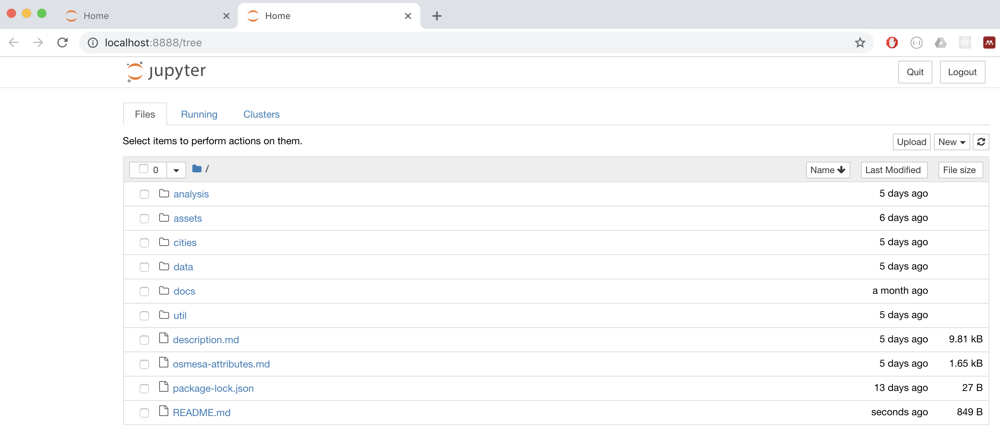
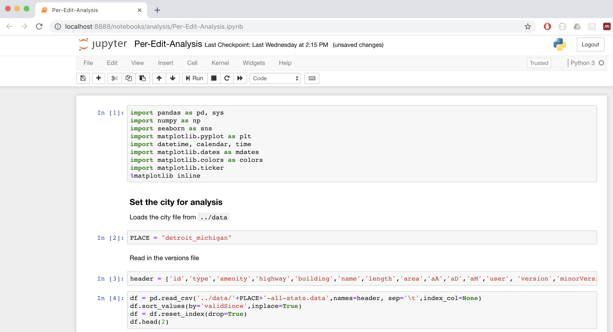
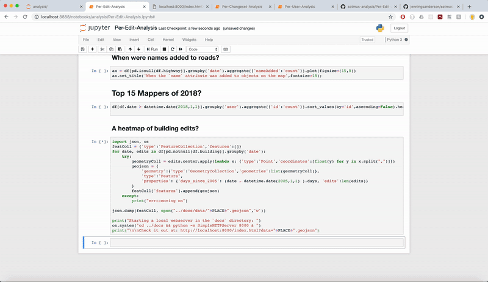

# State of the Map US Analysis Workshop: Example Analysis

See _description.md_ for a more thorought write-up of the workshop goals and approach. These are instructions to set up the analysis environment.

## Obtaining the data
The `data` directory currently includes only sample data for Detroit, Michigan. We do, however, have data prepared for other [US cities](#) that is available for download from the following S3 Bucket: 

## Running Locally

The `analysis	` folder contains sample [Jupyter Notebooks](http://jupyter.org/) in `python3`. See the [Jupyter website](http://jupyter.org/) for install instructions. This can be as easy as `pip install jupyter notebook`, depending on your environment.

Once you have Jupyter installed, you'll need the following python packages many of these are already installed with the [Anacondas Distribution](https://www.anaconda.com/download/)

#### Python Dependencies
`pandas` `numpy` `seaborn` `matplotlib` `networkx`

From the sotmus-analysis directory, run `jupyter notebook` and your browser should launch with the following:

To get started, click the analysis folder and open one of the notebooks: 

_The Per-Edit Analysis Notebook_

_A heatmap and timeline of building edits in Detroit constructed by the per-edit notebook_