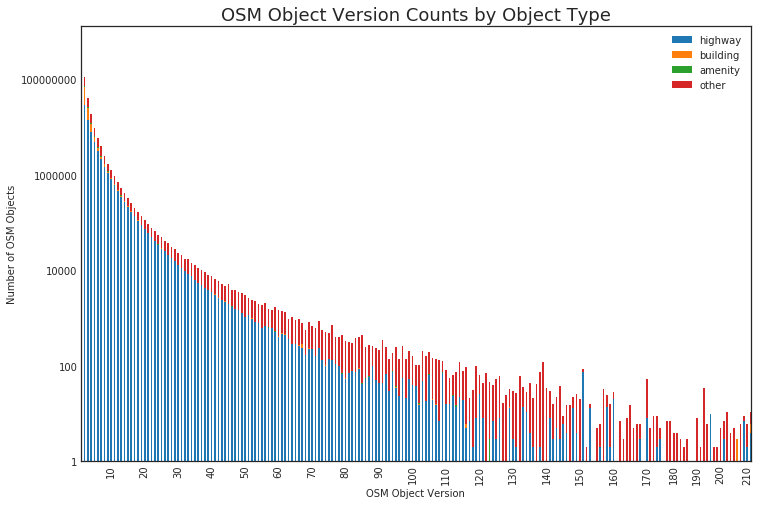
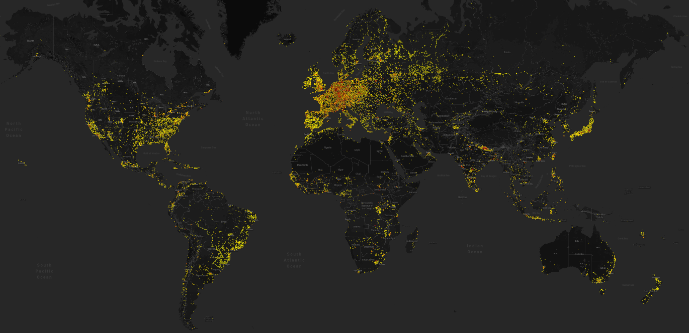

State of the Map US 2018: OpenStreetMap Data Analysis Workshop
=============
Jennings Anderson & Seth Fitzsimmons
Workshop: October 2018

#### Workshop Abstract

_With an overflowing Birds-of-a-Feather session on “OSM Data Analysis” the past few years at State of the Map US, we’d like to leave the nest as a flock. Many SotM-US attendees build and maintain various OSM data analysis systems, many of which have been and will be presented in independent sessions. Further, better analysis systems have yet to be built, and OSM analysis discussions often end with what is left to be built and how it can be done collaboratively. Our goal is to bring the data-analysis back into the discussion through an interactive workshop. Utilizing web-based interactive computation notebooks such as Zeppelin and Jupyter, we will step through the computation and visualization of various OpenStreetMap metrics._

## 1. How?
To pull this off, we're going to skip the messy data-wrangling parts of OSM data analysis and pre-process a number of datasets with [osm-wayback](https://github.com/osmlab/osm-wayback) and [osmesa](https://github.com/azavea/osmesa). The end result is a series of CSV files with various editing histories for a variety of US cities.

## 2. Background
There is a story behind every object on the map. OSM is more than an open map of the world. It is the cumulative product of billions of edits by nearly 1M active contributors (and another 4M registered users). Each object can be edited multiple times. Each time the major attributes of an object are changed in OSM, the version number is incremented. To get a rough idea of how many major changes exist in the current map, we can count the version numbers for every object in the latest [osm-qa-tiles](https://osmlab.github.io/osm-qa-tiles/). This isn't _every single_ object in OSM, but includes nearly all roads, POIs, and buildings.

> 

> OSM object versions by type. 475M objects in OSM have only been edited once, meaning they were created and haven't been subsequently edited in a major way. However, more than 200M have been edited more than once. _Note: Less than 10% of these edits are from bots, or imports._

To understand the evolution of the map, we need analysis tools that can expose these rich editing histories. There are a plethora of community-maintained tools out there to help parse and process the massive OSM database though none of them currenlty handle the full-history of each object on the map. Questions such as "how many contributors have been active in this particular area?" are then very difficult to answer at scale. As we should expect, this number varies drastically around the globe:

> 
> Map of areas with more than 10 active contributors in 2015 [source](http://mapbox.github.io/osm-analysis-collab/editor-density?yearIdx=10&layer=0&minUsers=10&minObjects=1&#3/30.72/15.15). The euro-centric editing focus doesn't surprise us, but this map also shows another area with an unprecedent number of active contributors in 2015: Nepal. This was in response to the April 2015 Nepal Earthquake. This is just one of many examples of the OSM editing history being situational, complex and often difficult to conceptualize at scale.

The purpose of this workshop was two-fold: first, we wanted to take the OSM data analysis discussion past the "how do we best handle the data?" to actual _analysis_ and second, we hoped that providing such an environment to explore the data would in turn generate more questions around the data: What is it that people want to measure? What are the insightful analytics?

## 3. Preparing the Data: What is Available?

This was the most hand-wavey part of the workshop, and intentionally so. Seth and I have been tackling the problems of historical OpenStreetMap data representation independently for a few years now. Preparing for this workshop was one of the first times we had a chance to compare some of the numbers produced by [OSMesa](//github.com/azavea/osmesa) and [OSM-Wayback](//github.com/osmlab/osm-waybac), our respective full-history analysis infrastructures. As expected, there were differences in how we count objects and versioning, but this was an opportunitistic time to sit down and talk through these differences and validate our measures. In short, there are many ways that people can edit the map and it's important to distinguish between the following types:

1. Creating a new object
2. Slightly editing an existing object's geometry (move the nodes around in a way)
3. Majorly editing an existing object's geometry (delete or add nodes in a way)
4. Edit an existing object's attributes (tag changes)
5. Delete an existing object

All but edit type (2) result in an increase in the version number of the OSM object. This makes identifying the edit easier at the OSM element level because the version number is true to the number of times the object has been edited. Edit type (2), a slight change to an object's geometry is, however, a common edit that is often overlooked because it differs from the version number. This type of edit could be moving the corners of a building to "square it up" or moving a road to align with better aerial imagery. We call these types of edits **_minor versions_**. To account for these types of edits, we add a metadata field to an object called `minor version` that is `0` for newly created objects and `> 0` for any number of minor version changes between a major version. When another major version is created, the minor version is reset to `0`. For more information on minor versions and how osm-wayback calculates them, see [this document](https://github.com/osmlab/osm-wayback/).

#### Quantifying Edits
Each of the above edit types refer to a single map object. In this context, we consider map objects to be OSM objects which have some level of detailed attribute. As opposed to OSM elements (nodes, ways, or relations), an object is the logical representation of a real-world object: road, building, or POI. This is an important distinction to make when talking about OSM data because this is not a 1-1 relationship. OSM elements do not represent map objects. A rectangular building object, for example, is at minimum 5 OSM elements: at least 4 nodes (likely untagged) that define the corners and the way that references these nodes with an attribute of `building=*`. An edit to any one of these objects is then considered an edit to this building.

This may seem obvious when thinking about editing OpenStreetMap and how the map gets made, but reconstructing this version of OSM editing history from the database is difficult and largely remains an unsolved (unimplemented) problem at the global scale: i.e., there does not yet exist a single end-point to a service to simply reconstruct the history of any arbitrary object with regards to all 5 types of edits mentioned above.

#### Making the data Available
For this workshop then, we pre-computed a number of statistics for various cities that describe the historical OSM editing record at per-edit, per-changeset, and per-user granularties (further described below).

## 5. Interative Analysis Environment

[Jupyter notebooks](http://jupyter.org) allowed us to host a single analysis environment for the workshop such that each participant did not have to install or run any analysis software on their own machines. For the workshpo, we used a single machine operated by ChameleonCloud.org to host the environment, though anyone can recreate the analysis environment locally:

*Post Workshop*: Want to recreate the analysis environment on your own?

1. [Download Jupyter](//jupyter.org)
2. Clone this repository: [jenningsanderson/sotmus-analysis](//github.com/jenningsanderson/sotmus-analysis)
3. Run Jupyter and nagivage to `sotmus-analysis/analysis/` for the notebook examples.

### 4. Available Notebooks &amp; Datasets
We pre-processed data for a variety of regions for with the following resolution:

1. [Per User Stats]()
2. [Per Changeset Stats]()
3. [Per Edit Stats]()

#### 1. Per User Stats
A comprehensive summary of editing statistics (new buildings, edited buildings, km of new roads, edited roads, number of sidewalks, etc.) [see full list here]() that are totaled for each user active in the area of interest. This dataset is ideal for comparing editing activity among users. Who has edited the most? Who is creating the most buildings? This dataset is great for building leaderboards and getting a general idea of how many users are active in an area and what the distribution of work per user looks like.

#### 2. Per Changeset Stats
The same editing statistics as above (see [full list of columns here]()) but with higher resolution: grouped by the changeset. A changeset is a very logical unit of anlaysis for looking at the evolution of the map in a given area. Since each changeset can only be from one user, this is the next level of detail from user summaries. Since changeset IDs are sequential, this is a great dataset for time-series analysis.

#### 3. Per Edit Stats
This dataset records each individual edit to the map. This dataset is best for understanding exactly what changed on the map with each edit. Each edit tracks the tags changed as well as the geometry changes (if any). This dataset is (not surprisingly) significantly larger than the other two.

## 5. Results (Example Notebooks)

